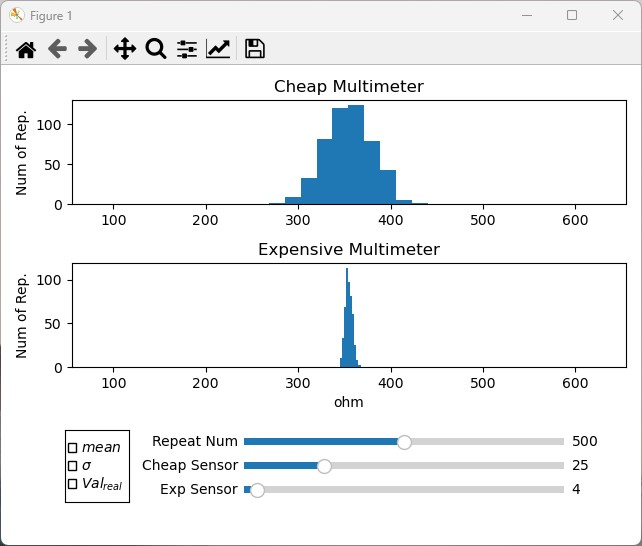

# Probability Theory Visual Tool

This is a simple visual tool that compares measurements taken by two different devices, each with two different error characteristics. With the help of this tool, you can see how measurement error affects data analysis and probability calculations.

## Installation

To use this tool, you will need to have Python 3 and matplotlib library installed on your computer. You can download Python 3 from the official website: https://www.python.org/downloads/ and install matplotlib by running the following command in your terminal or command prompt:
```
pip install matplotlib
```
Once you have installed Python 3 and matplotlib, you can download the source code from this Github repository. To do so, you can either download the ZIP file and extract it to a folder on your computer, or you can use Git to clone the repository:
```
git clone https://github.com/yourusername/probability-theory-tool.git
```
## Usage

To use the tool, simply run the following command in your terminal or command prompt:

```
python main.py
```

## Screenshot



## Contributing

If you would like to contribute to this project, please fork the repository and submit a pull request. We welcome all contributions, including bug fixes, feature requests, and code improvements.

## License

This project is licensed under the MIT License - see the [LICENSE](LICENSE) file for details.
